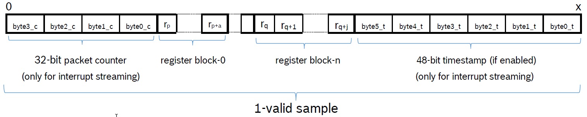

# coinesAPI calls: Streaming feature

**Note**:

- The below APIs are supported only on PC Target.
- A simpler approach of using `coines_attach_interrupt()` API for is available for MCU.


## coines_config_streaming
Sets the configuration for streaming sensor data.

```C
int16_t coines_config_streaming(uint8_t channel_id, struct coines_streaming_config *stream_config, struct coines_streaming_blocks *data_blocks); 
```

Arguments:

- `channel_id`: An integer number that can be used as identifier/index to the sensor data that will be streamed for this setting
- `stream_config`: Contains information regarding interface settings and streaming configuration.
-  `coines_streaming_blocks`: Contains information regarding numbers of register blocks, range and size of  each block.

**Note**:

The below parameters should always be set:

- `data_block.no_of_blocks`: number of blocks to stream (must at least be one)
- For each block b:
	- `data_block.reg_start_addr[b]`: start address of the block in the register map
	- `stream_block.no_of_data_bytes[b]`: number of addresses to read, starting from the start address

For reading data from I~2~C bus,then set the below parameters:
	
- `stream_config.intf = COINES_SENSOR_INTF_I2C;`
- `stream_config.i2c_bus`: I~2~C bus (in case of APP2.0, this is always `COINES_I2C_BUS_0`)
- `stream_config.dev_addr`: I~2~C address of the sensor

For reading data from SPI bus, then set the below parameters:

- `stream_config.intf = COINES_SENSOR_INTF_SPI;`
- `stream_config.spi_bus`: SPI bus (in case of APP2.0, this is always `COINES_SPI_BUS_0`)
- `stream_config.cs_pin`: CS pin of the sensor, information can be obtained from the shuttle board documentation for the sensor. 

When polling mode is requested, set the below parameters:
- `stream_config.sampling_units`:  
either milliseconds (`COINES_SAMPLING_TIME_IN_MILLI_SEC`)  
or microseconds (`COINES_SAMPLING_TIME_IN_MICRO_SEC`)
- `stream_config.sampling_time`: sampling period in the unit as defined in `stream_config.sampling_units`

When interrupt mode is requested, set the below parameters:

- `stream_config.int_pin`: pin of the interrupt which shall trigger the sensor read-out. If the interrupt output of the sensor is used, the required information about the pin number can be obtained from the shuttle board documentation for the sensor.
- `stream_config.int_timestamp`:  it can be configured if the sensor data is tagged with a timestamp (`COINES_TIMESTAMP_ENABLE`) or not (`COINES_TIMESTAMP_DISABLE`).

## coines_start_stop_streaming
Starts or stops sensor data streaming.

```C
int16_t coines_start_stop_streaming(enum coines_streaming_mode stream_mode, uint8_t start_stop);
```

Arguments:

- `stream_mode`: streaming mode (either `COINES_STREAMING_MODE_POLLING` or  
`COINES_STREAMING_MODE_INTERRUPT`)
- `start_stop`: flag to either start (`COINES_STREAMING_START`) or stop (`COINES_STREAMING_STOP`) the streaming

## coines_read_stream_sensor_data
Reads the data streamed from the sensor.

```C
int16_t coines_read_stream_sensor_data(uint8_t sensor_id, uint32_t number_of_samples, uint8_t *data, uint32_t *valid_samples_count);
```

Arguments:

- `sensor_id`: id of the sensor 
- `number_of_samples`: number of samples the user wishes to read (not implemented)
- `data`: data buffer
	- Interrupt streaming - Packet counter + Register data + Timestamp
	- Polling streaming - Register data
- `valid_samples_count`: number of samples the user has actually received (may be less than `number_of_samples`)

Example of a packet:

<figure markdown>
  { width="700"}
  <figcaption>Format of streaming packages</figcaption>
</figure>

In the above figure, the following meaning apply to the mentioned abreviations:

- r~p~: Value at register address p
- a: Size of register block–0
- r~p+a~: Value at register address p

Similarly is the case for r~q~, j and r~q+j~.
See the `coines_streaming_blocks` structure for information regarding register blocks.

The packet counter and the timestamp can be obtained as follows:

```C
packet_counter = (byte3_c << 24) | (byte2_c << 16) | (byte1_c << 8) | (byte0_c);
timestamp = (byte5_t << 40) | (byte4_t << 32) | (byte3_t << 24) | (byte2_t << 16) | (byte1_t << 8) | (byte0_t);
```

The 48-bit timestamp is enabled by using `coines_trigger_timer(COINES_TIMER_START,  COINES_TIMESTAMP_ENABLE);`

Timestamp in microseconds can be obtained using below formula:

$$ Timestamp\ (\mu s) = \frac{48bit\_timestamp}{30}$$

## coines_trigger_timer
Triggers the timer in firmware and also enables or disables the time stamp feature.

```C
int16_t coines_trigger_timer(enum coines_timer_config tmr_cfg,enum coines_time_stamp_config ts_cfg);
```

Arguments:

- `tmr_cfg`: start, stop or reset the timer (`COINES_TIMER_START`, `COINES_TIMER_STOP` or `COINES_TIMER_RESET`) 
- `ts_cfg`: Enables/disables microcontroller timestamp  (`COINES_TIMESTAMP_ENABLE` or `COINES_TIMESTAMP_DISABLE`) 

