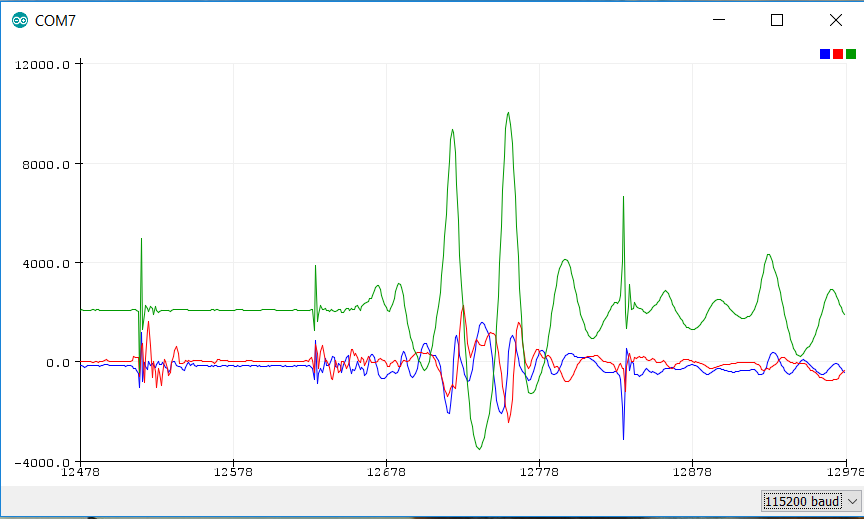

# Data plotting and visualization

When compiling an example to run on MCU (for example TARGET=MCU_APP20, see above), the obtained sensor data can easily be plotted in the serial plotter of the Arduino IDE.

The example application must print the sensor data to be plotted in a text string, with a terminating new line character.
Multiple sensor values per axis are possible.
The `printf` command will stream the sensor data in an ASCII string via (virtual) COM port.
Once the user connects to the COM port and opens the Arduino serial plotter, the data will be displayed in a graphical way.

Notes and hints:

- If the user wants to use an other plotting software, he must consider that the DTR signal line must be set, otherwise the flashed application on the application board will not start running. The serial plotter and serial monitor of Arduino IDE set this signal automatically, other software (like HTerm) have the option to do this manually.
- The plotting window offers automatic re-sizing. If the user does not want this and needs fixed limits, he could plot the limits as additional lines.  
Example: `printf("\%d \%d \%d\textbackslash n", lower_limit, sensor_data, upper_limit);`
- In case of sensor data with a high offset, such as the output of a barometric pressure sensor, which is usually around 100000 Pa, the user may want to substract a certain offset, so see details of the signal.  
Example: `printf("\%d\textbackslash n", (pressure - 99000));`

<figure markdown>

  { width="700"}
  <figcaption>Fig. 14: Accelerometer sensor data on Arduino Serial Plotter</figcaption>
</figure>
