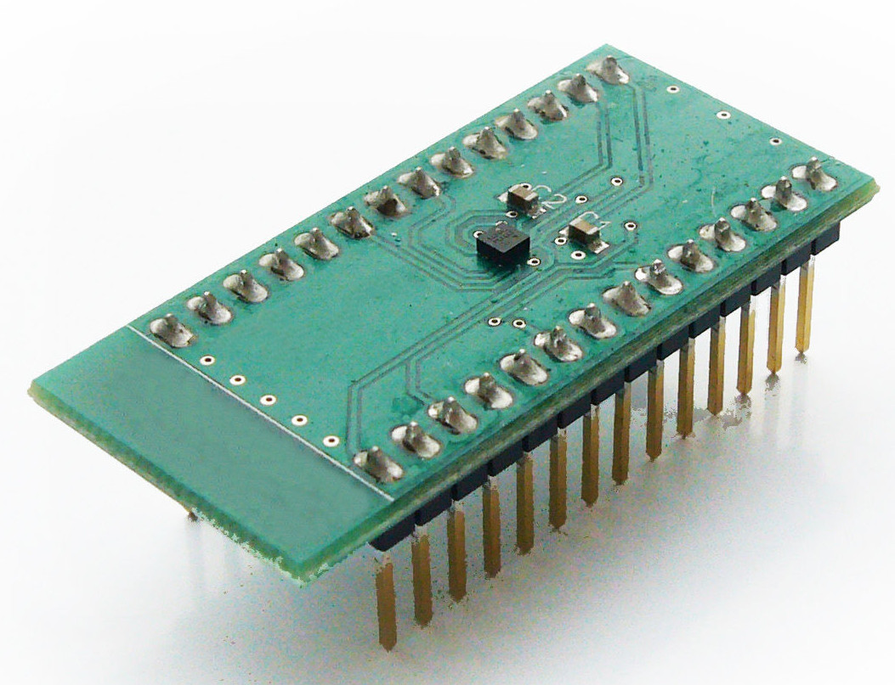
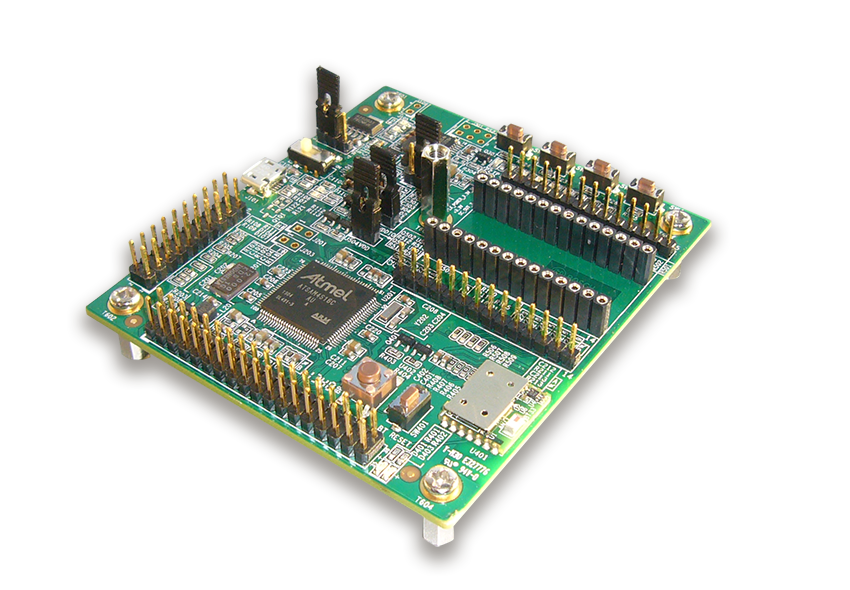
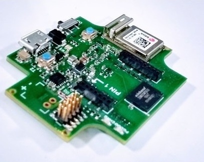

# Introduction

Bosch Sensortec offers a toolkit for evaluation of it’s sensor products.The toolkit consisting of 3
elements:

1. A sensor specific shuttle board also known as breakout board.
APP3.0 shuttle boards also known as mini shuttle boards has smaller form factor when compared with APP2.0 shuttle board.

<figure markdown>
  { width="300"}
  <figcaption>APP2.0 shuttle board</figcaption>
</figure>
<figure markdown>
  { width="300"}
  <figcaption>app3.0 shuttle board</figcaption>
</figure>

2. [Application Board](https://www.bosch-sensortec.com/software-tools/tools/application-board-3-0/) has a connector for the shuttle board and serves as interface translator from the sensor interface (I~2~C or SPI) to a USB interface, allowing PC software to communicate with the sensor on the shuttle.

<figure markdown>
  { width="300"}
  <figcaption>Application Board 2.0</figcaption>
</figure>
<figure markdown>
  { width="300"}
  <figcaption>Application Board 3.0</figcaption>
</figure>

3. On the PC side, Bosch Sensortec provides the software packages Development Desktop 2.0 and COINES to connect to the sensor on the Application Board.

    - Development Desktop 2.0 provides a GUI which allows to configure the sensor, plot and export streamed sensor data.

    - COINES provides a C based interface, which allows to communicate with the sensor using the SensorAPI from Bosch Sensortec on the PC side.

    - Starting from COINES v2.0, user has an option to cross-compile the example and run it directly on the Application Board’s microcontroller.

