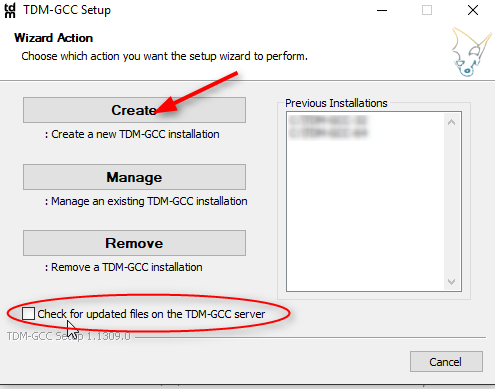

# Installation of compiler environment

COINES C examples can be built using GNU C compiler (GCC).
There are various distributions of GCC.
TDM-GCC is easy to install and hence preferred for COINES.
TDM GCC is based on MinGW GCC.

If you have already installed GCC (MinGW/Cygwin/MSYS2 GCC) and added to 'PATH' environmental variable, you can skip compiler installation.

1. Download the TDM32/TDM64 bundle ([link](http://tdm-gcc.tdragon.net/)).
**Use TDM32 bundle if your Windows OS is 32-bit and TDM64 bundle if 64-bit.**
2. Start the Installer.
Ensure that the option Check for updated files on the TDM GCC server is unchecked.
Click Create and proceed with the installation.
3. If you intend to do run the COINES example on Application Board's microcontroller, install the latest version of [GNU Embedded Toolchain for ARM](https://developer.arm.com/open-source/gnu-toolchain/gnu-rm/downloads) for Windows.
Make sure you have checked 'Add path to environmental variable'

<figure markdown>

  { width="500"}
  <figcaption>Fig. 6: TDM-GCC installation dialog</figcaption>
</figure>

<figure markdown>

  { width="500"}
  <figcaption>Fig. 7: GNU ARM Toolchain installation</figcaption>
</figure>