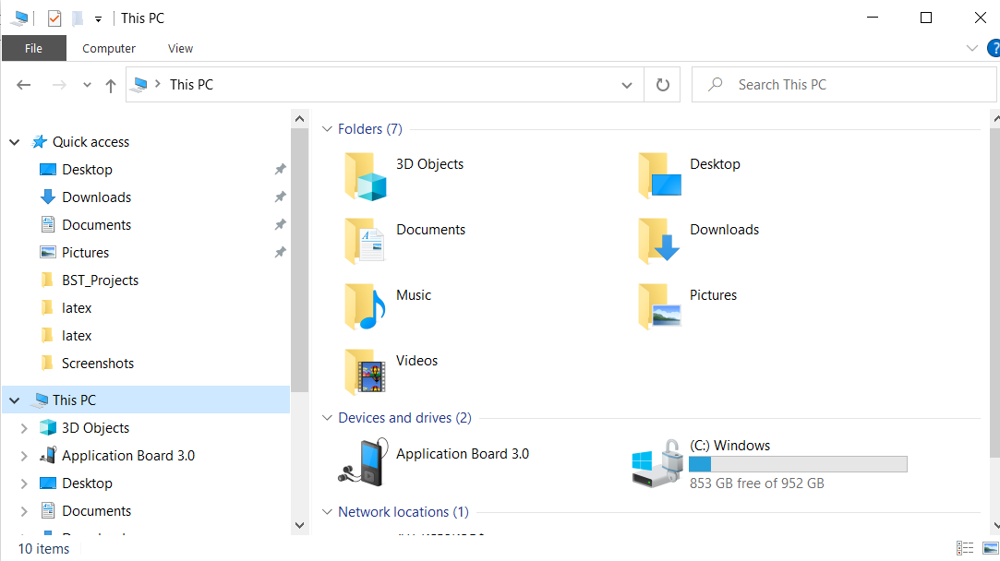

# Copying the files using MTP

- Connect the Application Board 3.0 using USB cable to PC.
- Turn OFF and turn ON the board with T1 pressed.
- The device will enumerate as an MTP device with name "Application Board 3.0". Click on it and select the "W25M02 External Memory".
- The device will list all the available files and all required files can be copied.

<figure markdown>

  { width="700"}
  <figcaption>Fig. 15: Copy data log files to the PC over USB MTP</figcaption>
</figure>
